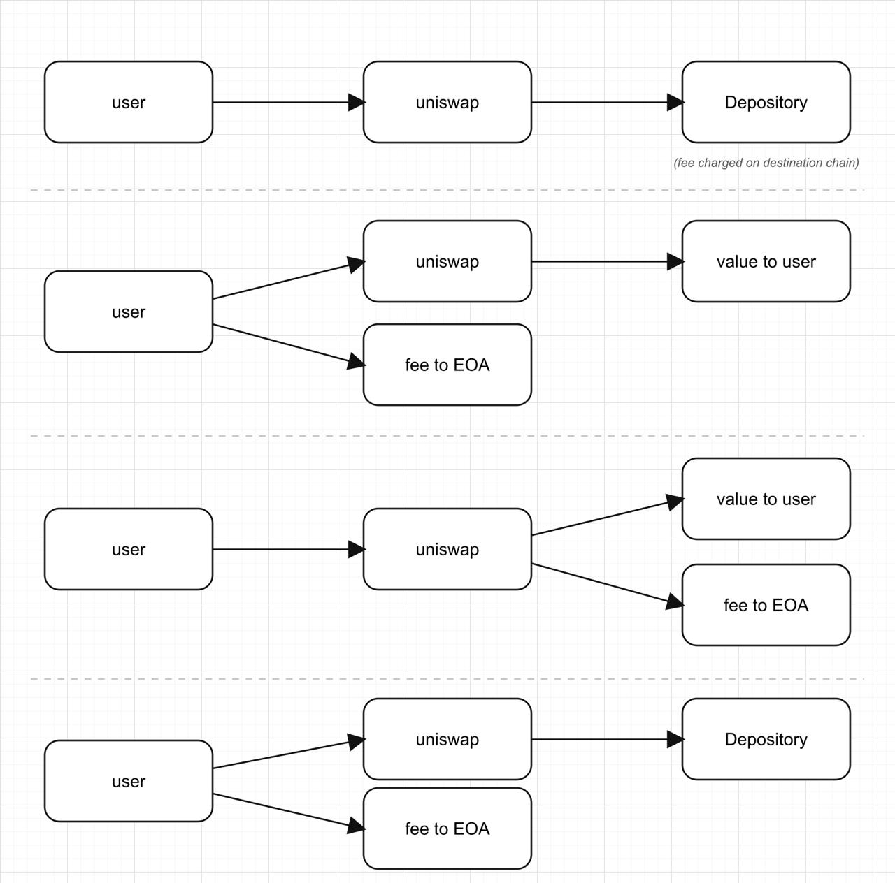

# Experiment: SplitForwarder — untouched depository + venue-independent payouts

**Two questions, both answered yes, all proven on Sepolia:**

1. Can the Layerswap depository stay **100% original** (no `depositERC20All`
   extension) with fully-dynamic, zero-dust deposits — including **native ETH**?
2. Can the payout splitting stop depending on the Universal Router's payment
   commands (`PAY_PORTION`/`SWEEP`), so the whole system works with **any swap
   venue** — 0x Settler included — that can merely *swap and deliver output to
   an address*?

Both are solved by **one** stateless contract:
[`SplitForwarder`](https://sepolia.etherscan.io/address/0x28E815496471724e7DBA95D1a11b014110Cdb2FC#code)
(`0x28E8…b2FC`, verified — current deploy, includes `permitAndRun`).

> **Deployment:** the current `SplitForwarder` is `0x28E8…b2FC` (audit-fixed:
> always-native terminal check, intake-token check, `Math.mulDiv`). The full
> 12-flow matrix below was **re-broadcast on this exact contract** — all live
> hashes point at `0x28E8…b2FC`.

**Update — intent-bound user-sent flows (no MEV assumption).** The contract now
also exposes `runWithPermit`, which pulls the user's ERC-20 via Permit2's
**`permitWitnessTransferFrom`** with a witness committing to
`keccak256(abi.encode(splits))` — the entire payout plan. This makes every
user-sent ERC-20 flow a **single direct SF call that is safe on a public
mempool with NO submission assumptions**: a front-runner who copies the pending
signature can only execute the user's exact plan (funds are forced to the
forwarder; altering any split changes the witness and invalidates the
signature) — i.e. they would merely pay the user's gas. This removes the
previous "MEV-protected submission required" caveat and drops Multicall3 from
the system entirely.

## The contract

```solidity
struct Leg  { address target; uint96 shareBps; uint256 amountOffset; bytes data; }
struct TokenSplit { address token; Leg[] legs; }        // token = address(0) → native
function run(TokenSplit[] calldata splits) external payable
```

- **Several tokens AND native ETH in one call** — splits are processed
  *sequentially*, so an earlier split's hook (e.g. a swap paying this contract)
  can produce the balance a later split distributes.
- Each leg: plain transfer (empty `data`) or **calldata hook** — the leg's
  run-time amount is patched into the template at `amountOffset`
  (`NO_SUBSTITUTION` for native hooks where the amount rides as `msg.value`,
  e.g. `depositNative`). ERC-20 hooks get exact approve + reset; reverts bubble.
- Bips of one split must sum to exactly 10000 or the whole tx **reverts**;
  the **last leg takes the arithmetic remainder** (rounding dust impossible);
  terminal per-token zero-balance check (`BalanceNotConsumed`) enforces that
  nothing stays behind. A **zero-bps "call-only" leg** invokes a target without
  moving an amount (e.g. run `router.execute` after a plain leg pre-funded it).
- `runWithPermit(permit, owner, splits, sig)` — intent-bound user entry:
  Permit2 `permitWitnessTransferFrom` with `witness = keccak256(splits)`.
- Trust model = router: stateless, no owner, permissionless —
  **never park funds in it across transactions**.

## The flows re-proven here



Every split and every deposit now happens in `SF.run`; the swap venue only
swaps and delivers to an address (that's the entire venue contract surface —
0x-swappable). Two structural wins along the way:

- **user-eth flows became ONE direct `SF.run{value}` call** — no Multicall3:
  a native hook leg carries its amount as `msg.value` straight into
  `router.execute` (the UR rejects plain ETH sends, so value must ride with
  the call), and the next TokenSplit distributes the swap output.
- Flow 3's split is **live-exact bips of the actual output** — computed by SF
  on its real balance, venue-agnostic.

## Execution shapes, cell by cell

`X` = the user's input; `▸amount◂` = patched into the calldata by SF at run
time; hooks marked with `→` carry the leg's amount (calldata patch for ERC-20,
`msg.value` for native).

### Flow 1 — all in → swap → deposit full output

**gasless** (relayer's Calibur batch; user signed EIP-3009 only):
```
Calibur batch: [
  USDC.receiveWithAuthorization(user → executor, X),
  USDC.transfer(router, X),
  router.execute( swap USDC→WETH, recipient = SF ),
  SF.run([ { WETH, [ 100% hook → depositERC20(id, WETH, receiver, ▸amount◂) ] } ])
]
```
**user-erc20** (ONE direct SF.runWithPermit tx — witness = keccak256(splits),
public-mempool-safe):
```
SF.runWithPermit(permit{USDC, X}, user, splits, sig) where splits = [
  split[0] = { USDC, [ 100% → router (plain),
                       call-only → router.execute(swap USDC→WETH → SF) ] },
  split[1] = { WETH, [ 100% hook → depositERC20(…, ▸amount◂) ] }
]
```
**user-eth** (ONE direct SF call):
```
SF.run{value: X}([
  split[0] = { native, [ 100% hook → router.execute{value}(WRAP_ETH, swap → SF) ] },
  split[1] = { USDC,   [ 100% hook → depositERC20(id, USDC, receiver, ▸amount◂) ] }
])
```

### Flow 2 — SF splits input (exact fee); venue delivers to user

**gasless**:
```
Calibur batch: [
  USDC.receiveWithAuthorization(user → executor, X),
  USDC.transfer(SF, X),
  SF.run([ { USDC, [ 12.34% → feeEOA, remainder → router ] } ]),
  router.execute( swap CONTRACT_BALANCE → recipient = user )
]
```
**user-erc20** (ONE direct SF.runWithPermit tx, public-mempool-safe):
```
SF.runWithPermit(permit{USDC, X}, user, splits, sig) where splits = [
  { USDC, [ 12.34% → feeEOA, remainder → router (plain),
            call-only → router.execute(swap → user) ] }
]
```
**user-eth** (ONE direct SF call — the remainder leg IS the swap):
```
SF.run{value: X}([
  { native, [ 12.34% → feeEOA,
              remainder hook → router.execute{value}(WRAP_ETH, swap → user) ] }
])
```

### Flow 3 — swap all → SF splits the ACTUAL output

**gasless**:
```
Calibur batch: [
  USDC.receiveWithAuthorization(user → executor, X),
  USDC.transfer(router, X),
  router.execute( swap USDC→WETH, recipient = SF ),
  SF.run([ { WETH, [ 12.34% → feeEOA, remainder → user ] } ])   // live-exact bips
]
```
**user-erc20** (ONE direct SF.runWithPermit tx, public-mempool-safe):
```
SF.runWithPermit(permit{USDC, X}, user, splits, sig) where splits = [
  split[0] = { USDC, [ 100% → router (plain),
                       call-only → router.execute(swap → SF) ] },
  split[1] = { WETH, [ 12.34% → feeEOA, remainder → user ] }   // live-exact bips
]
```
**user-eth** (ONE direct SF call — split[0]'s hook produces split[1]'s balance):
```
SF.run{value: X}([
  split[0] = { native, [ 100% hook → router.execute{value}(WRAP_ETH, swap → SF) ] },
  split[1] = { USDC,   [ 12.34% → feeEOA, remainder → user ] }
])
```

### Flow 4 — SF splits input (fee); venue swaps rest → SF deposits full output

**gasless**:
```
Calibur batch: [
  USDC.receiveWithAuthorization(user → executor, X),
  USDC.transfer(SF, X),
  SF.run([ { USDC, [ 12.34% → feeEOA, remainder → router ] } ]),
  router.execute( swap → SF ),
  SF.run([ { WETH, [ 100% hook → depositERC20(…, ▸amount◂) ] } ])
]
```
**user-erc20** (ONE direct SF.runWithPermit tx, public-mempool-safe):
```
SF.runWithPermit(permit{USDC, X}, user, splits, sig) where splits = [
  split[0] = { USDC, [ 12.34% → feeEOA, remainder → router (plain),
                       call-only → router.execute(swap → SF) ] },
  split[1] = { WETH, [ 100% hook → depositERC20(…, ▸amount◂) ] }
]
```
**user-eth** (ONE direct SF call):
```
SF.run{value: X}([
  { native, [ 12.34% → feeEOA,
              remainder hook → router.execute{value}(WRAP_ETH, swap → SF) ] },
  { USDC,   [ 100% hook → depositERC20(id, USDC, receiver, ▸amount◂) ] }
])
```

### Native deposit demo — dynamic msg.value into depositNative

```
Calibur batch: [
  USDC.receiveWithAuthorization(user → executor, X),
  USDC.transfer(router, X),
  router.execute( swap USDC→WETH → router, UNWRAP_WETH → native ETH → SF ),
  SF.run([ { native, [ 100% hook → depositNative{value: ▸amount◂}(id, receiver) ] } ])
]
```

## Security: user-sent ERC-20 flows are mempool-safe (intent-bound)

On this branch **every** user-erc20 flow (1–4) uses the Multicall3 + in-batch
EIP-2612 permit shape, so this caveat now covers all of them (on the main
branch it applied only to flows 1 & 4).

**✅ RESOLVED — the intent-bound `runWithPermit` closes this entirely.** The
earlier version of this branch pulled the user's ERC-20 via Multicall3 + a bare
EIP-2612 permit, which was front-runnable on a public mempool (the permit was
bound only to `spender = Multicall3`, which anyone can drive) and therefore
required MEV-protected submission on mainnet. That is gone. All user-erc20
flows now use `SF.runWithPermit`, where the user's Permit2
`permitWitnessTransferFrom` signature commits to
`witness = keccak256(abi.encode(splits))` — the entire payout plan.

**Why it's now public-mempool-safe with no submission assumption:** a
front-runner who copies the pending signature is forced into your exact intent —
- the funds can only go to the SplitForwarder (`transferDetails.to` is
  hardcoded to `address(this)` in `runWithPermit`, not caller-chosen);
- the splits are pinned by the witness — change any recipient, bips, or hook
  and the witness changes, so Permit2's `InvalidSigner` rejects the signature;
- so the *only* thing a replayer can do is execute the user's exact flow, at
  their own gas expense.

**Proven on-chain:** `testFork_Intent_AlteredSplitsReplayReverts` — an attacker
replays a valid signature with a malicious "100% → me" split; Permit2 reverts,
user funds untouched, attacker gets nothing.

The one residual (unchanged, and true of any signature scheme): a leaked
signature for the *honest* plan can be submitted by anyone — but doing so only
executes what the user authorized, to the recipients the user chose.

## The 12 proven flows — all on the fixed SplitForwarder `0x28E8…b2FC` (original depository `0xbc51…D0b4`)

user-erc20 = ONE direct `SF.runWithPermit` tx from the user (public-mempool-safe);
user-eth = ONE direct `SF.run{value}` tx.

| Flow | gasless | user-erc20 (intent-bound) | user-eth |
|---|---|---|---|
| **1** all → swap → deposit full output | [`0xca5cf09f…`](https://sepolia.etherscan.io/tx/0xca5cf09f8dd0c24709a615a7bf523c3931c0b8b4c5d2a09bff3120aa71006fe9) 248,693 | [`0xd6da7659…`](https://sepolia.etherscan.io/tx/0xd6da765931c396d00b9baecd6cd2a7fc049a0282ebee2aeea2d6a9594270ab65) 258,213 | [`0xed683e7e…`](https://sepolia.etherscan.io/tx/0xed683e7eaf5ad74056c1a0d79d6de8c13b55fd08a5f7d7a0c6798793ffa90cd3) 199,474 |
| **2** SF splits input (exact fee); venue → user | [`0x204fd22e…`](https://sepolia.etherscan.io/tx/0x204fd22ef8fd7103e71325fcb03b545ee2f34174707667752dc16427d0334c7d) 234,790 | [`0xb2a9793b…`](https://sepolia.etherscan.io/tx/0xb2a9793b6b82b3b11b5fdfd17b1366c08c8c10f2efbb9a783cbe4af57328d183) 216,092 | [`0x460b630b…`](https://sepolia.etherscan.io/tx/0x460b630bb7df53ba7f5feb42de89d447ced65f106d8c6e253cb6a8182f9ec286) 161,436 |
| **3** swap all → SF splits ACTUAL output | [`0xa452e244…`](https://sepolia.etherscan.io/tx/0xa452e2447ed94dfa7fa3161400d995c51cd2ff2b33b4c22d0b273b19204295e6) 223,340 | [`0xf4100c0b…`](https://sepolia.etherscan.io/tx/0xf4100c0b662237d596893564d99d89c4a17fca3d6f544c944410df00c485d94f) 233,432 | [`0xc8f76971…`](https://sepolia.etherscan.io/tx/0xc8f76971c75441e68162fc353eb8bebc042c68ecece7b3bcdb91d42c5dcb285c) 174,510 |
| **4** SF splits input; venue → SF deposits full output | [`0xa7354c86…`](https://sepolia.etherscan.io/tx/0xa7354c86f6e46614090e4acb18100988af518ade465cf728c8ef582c0d9cf4a1) 298,271 | [`0xd551cea5…`](https://sepolia.etherscan.io/tx/0xd551cea5577de8c7330b239831612c71ea3b2f7ae6a518aefc63936ac5b00c6a) 273,328 | [`0x0bb1ee4b…`](https://sepolia.etherscan.io/tx/0x0bb1ee4b4d35bb4f07870d3697da6c21a4c58543fd5954c82d7ab5bf34e2dad6) 212,884 |

**Native dynamic deposit** — the capability the extended depository
*fundamentally cannot offer* (native amounts must ride as `msg.value`; no
contract can pull ETH from its caller):
swap → `UNWRAP_WETH` → native ETH to SF → `depositNative` with **dynamic
msg.value** → `Deposited(id, address(0), receiver, amount)`:
[`0x6ff9caf5…`](https://sepolia.etherscan.io/tx/0x6ff9caf5dc5078e57d158b2e3be16df77a31823c69b23e054a1a841d3f75486c) 243,237.

Audited after all 13: SplitForwarder and router at **exactly 0** in
ETH/USDC/WETH.

## Add-on: EIP-2612 self-submit (`permitAndRun`) — no Permit2, no approve

For **permit-capable tokens in the with-gas (user-pays) mode**, `permitAndRun`
removes the one-time `approve(Permit2)` entirely: the user signs a native
EIP-2612 `permit(user, SF, value)` and calls
`SF.permitAndRun(token, value, deadline, v, r, s, splits)` directly.

Safe on a public mempool **without a witness** — the binding is structural:
the pull is `transferFrom(msg.sender, …)`, so the permit owner is forced to the
caller. A replayer calling with the user's signature does `permit(attacker, …)`
(fails to recover the user's sig → caught), then pulls from *themselves*. Proven:
`testFork_Permit2612_ReplayCannotDrainUser`.

Selected with `ERC20_AUTH=2612` (default `permit2`). Proven on Sepolia
(sender = the payer, USDC's native permit, Permit2 never touched):

| Flow | user-erc20 · `ERC20_AUTH=2612` (on `0x28E8…b2FC`) |
|---|---|
| **1** all → swap → deposit full output | [`0x147a06e6…`](https://sepolia.etherscan.io/tx/0x147a06e6fabf9ce0864b29059871e08b5f8a1727b465a27e987ad22ab10063be) 256,701 |
| **4** SF splits input; venue → SF deposits full output | [`0x6751533b…`](https://sepolia.etherscan.io/tx/0x6751533b985f69b29b3bdea939210f8e5628c3dc01a26aeded84272bc3f6fa4e) 271,212 |

(Direct `SF.permitAndRun` calls — selector `0x4fe50e40`; SF ends at 0.)

## 0x venue — proven against the REAL Settler (Ethereum mainnet fork)

The swap step is a hook leg, so **0x drops in exactly like the Universal
Router** with no SF change: SF `approve`s the real AllowanceHolder
(`0x0000…22734`) and calls it with live **0x Swap API** calldata (the
`exec`/Settler route), 0x pulls the sell token and delivers the buy token to
the taker (= SF), the next split distributes it — synchronous and atomic
(Swap API, not the async Gasless/intent product).

Proven with **no mock**: `test/ZeroxMainnetFork.t.sol` forks Ethereum mainnet,
fetches a live quote via `script/zerox_quote.sh` (ffi → 0x API, taker = the
forked SF address), and swaps **100 USDC → WETH through the real Settler and
real liquidity**, then splits the actual output 12.34% fee / remainder to the
user. Run:

```bash
set -a; source .env; set +a            # provides ZEROX_API_KEY
export MAINNET_RPC_URL=https://ethereum-rpc.publicnode.com
forge test --ffi --fork-url $MAINNET_RPC_URL --match-contract ZeroxMainnetFork -vv
```

Result: WETH out ≈ 0.0523 (≥ the API's `minBuyAmount`), fee = exactly 12.34% of
the real output, SF ends at 0 in USDC/WETH/ETH.

**Real-world finding:** the live 0x Settler delivered a small **native-ETH
surplus** (~0.000577 ETH, positive slippage) to the taker. Our terminal
native-balance check (audit fix) correctly caught it — a naive flow with no
native split would have reverted. The robust shape adds a native sweep leg, so
the surplus is forwarded (here, to the user) and nothing is stranded. This is a
genuine 0x integration nuance: **account for possible native surplus.**

(Skipped automatically in the normal `forge test` — needs `MAINNET_RPC_URL`,
`--ffi`, and `ZEROX_API_KEY`.)

**Mixed venues in one tx.** `testFork_MixedVenue_0xAndUniswap_SameRun` swaps
half the USDC through **real 0x** and half through **real Uniswap
(SwapRouter02)** in a single `run()` — two hook legs, different targets, no
conflict, combined WETH output split to the user, zero dust. Venues are just
hook targets, so any mix coexists.

> **Why the hardcoded `PERMIT2` doesn't limit this:** the `PERMIT2` constant is
> used ONLY by `runWithPermit` (inbound pull). Swap venues — 0x's
> AllowanceHolder, Uniswap's router — are never constants; they arrive as the
> `target` of a hook leg (caller-supplied in the splits). So adding/using any
> venue needs no contract change.

## Fly (Magpie) venue — proven against the REAL router (Ethereum mainnet fork)

Same approach as 0x, second venue: `test/FlyMainnetFork.t.sol` forks Ethereum
mainnet and swaps **100 USDC → WETH through the real MagpieRouterV3**
(`0x20F6…860c`) using a **live Fly Swap API** quote (`script/fly_quote.sh`,
`/aggregator/quote/transaction`, taker = the forked SF), then splits the actual
output 12.34% fee / remainder. SF hook = `approve(router) → call(swapWithMagpieSignature)`.
No SF change (venue = hook target). Run:

```bash
export MAINNET_RPC_URL=https://ethereum-rpc.publicnode.com
forge test --ffi --match-contract FlyMainnetFork -vv
```

Two notes from doing it:
- **Fly's quote is keyless** (`/aggregator/*` needs no API key) — unlike 0x.
- **Correction to the earlier 0x "native surplus" claim:** with SF's native
  balance zeroed in `setUp`, the Fly run leaves **zero** native — proving the
  tiny native leftover previously seen (identical `577021548053172` wei in both
  the 0x and Fly runs) was a **fork address-collision balance** at the freshly
  deployed SF address, *not* swap surplus / positive slippage. The Fly test
  zeroes SF and needs no native sweep leg. (The 0x test still carries a harmless
  sweep leg; it will be corrected on the next 0x-key re-auth — the free key was
  rate-limited during this pass. Fly, being keyless, was unaffected.)

## Gas — the price of venue independence

user-erc20 and user-eth are now ONE self-contained tx each (no Multicall3, no
outer batch). Roughly, per flow: gasless ~225–298k, user-erc20 ~214–272k,
user-eth ~153–213k. The overhead vs the main branch (extended depository +
UR-native `PAY_PORTION`/`SWEEP`) is the SF hop(s) — an extra external call,
`balanceOf` reads, approve set/reset per ERC-20 hook, and transfers the UR
previously did in-place — on the order of **+15–45k per flow**. That is the
cost of (a) an untouched depository, (b) venue-independence (swap in 0x with
zero contract changes), and (c) mempool-safe user-sent ERC-20 with no MEV
assumption.

## Trade-off summary vs the main branch

| | Main branch (`depositERC20All` + UR commands) | This branch (`SplitForwarder`) |
|---|---|---|
| Depository | modified/redeployed | **100% original** |
| Venue coupling | splits depend on UR `PAY_PORTION`/`SWEEP` | **any venue that delivers to an address (0x-ready)** |
| Native dynamic deposit | ❌ impossible | ✅ proven |
| Multi-token + native in one payout call | ❌ | ✅ |
| user-eth entry | Multicall3 / router | **one direct SF call** |
| user-erc20 entry | router-only (2&3) / Multicall3+permit (1&4, **needs private submission**) | **one direct `SF.runWithPermit` — intent-bound, mempool-safe, NO MEV assumption** |
| Gas | baseline | +15k … +45k per flow |
| Custom code | 1 function in the depository | 1 standalone ~230-line contract |

**Conclusion:** if 0x (or any non-Uniswap venue) is on the roadmap or the
depository must stay untouched, the SplitForwarder branch is the shape to ship —
you pay ~+15–45k gas per flow; in exchange the entire payout logic lives in one
audited-once periphery, the venue becomes a plug-in, native dynamic deposits
work, and user-sent ERC-20 flows are safe on a public mempool with **no
MEV-protected-submission requirement** (the intent-bound `runWithPermit`
supersedes the earlier Multicall3+permit caveat entirely).
